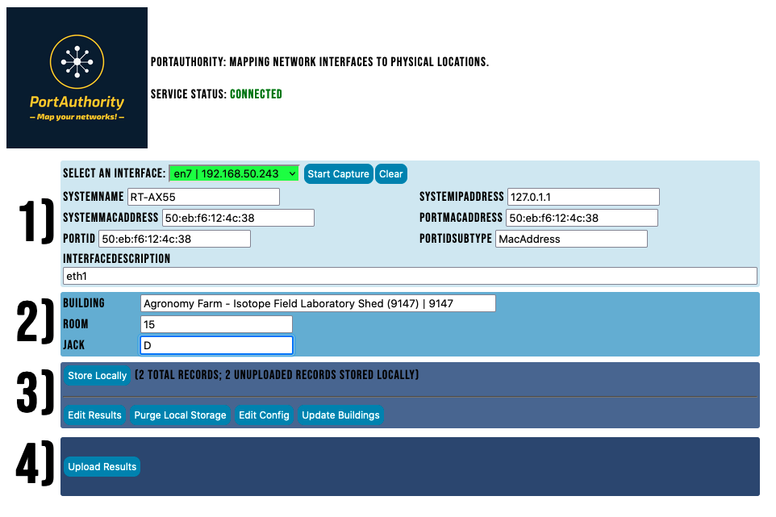

# PortAuthority vInf
Use scapy to listen to LLDP broadcasts, Flask+HTML+JS to produce a simple GUI, and requests to upload them to a server
(C) The Ohio State University; Authored by Chris Hartley - hartleyc@gmail.com

Map network interfaces to physical locations

On windows, you'll need to install winpcap.  Installing something like npcap will work just fine.
On windows, you'll also need to install python.  I bet anything >= 3.0 should work, but go for 3.10 or so.
WINinstall.BAT will probably handle this, though. YMMV.
On OS X, you should be good to go.
On Linux, you should be good to go.
On *BSD, you should be good to go.

I think the code is simple enough that the included comments probably cover how this thing works.

Someone will come along and write a README at some point, I guess.  The basic idea is that this tool collects LLDP data, stores it locally, and can send it to an API for long-term storage.  

Why?  Well, it's helpful to know where cables go.  Which jack is connected to this switch interface, etc... that's helpful if you care where your cables are going.  Or if you have an E911 requirement, for instance.

Please let me know about any issues you run into, but understand that this is a client only.  You'll need to provide a server, configure an access token and its URLs, and it will have to honor the simple REST requests the client makes - or you can change those queries trivially!
